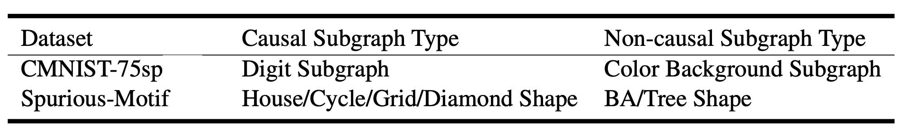
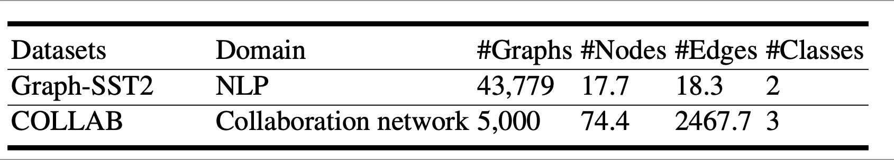
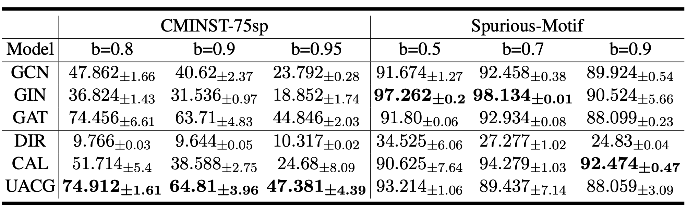
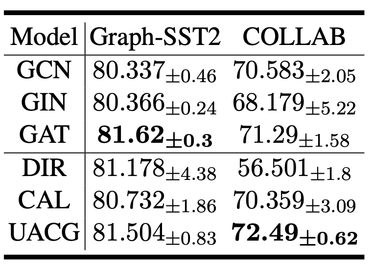
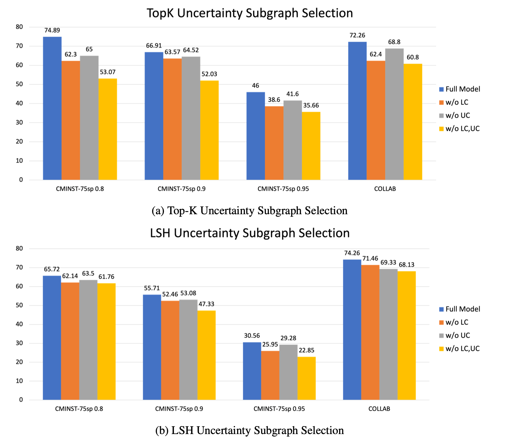

# Uncertainty-aware Causal Graph Learning

This is my master degree dissertation:[Uncertainty-aware Causal Graph Learning( pdf link )](Dissertation/Li_Cheng__Debase_Graph_Encoder.pdf)

## Introduction
GNNs ideally utilize subgraphs to predict labels when the graphs are unbiased, indicating that only causal subgraphs are related to the graph labels. However, graph datasets inevitably contain biases due to uncontrollable data collection methods. Consider Figure 1 where most of the digit backgrounds are the same, such as the red background for “zero”. In this case, GNNs do not need to learn the correct function to achieve high accuracy in predicting the digit labels. Instead, it is much easier for them to learn statistical shortcuts that link the background color with the most frequently occurring digit in each case. Unfortunately, such methods generalize poorly when encountering out-of-distribution (OOD) data, where the background color changes in the testing dataset. Consequently, these non-causal subgraphs, which are only marginally related to the causal part, provide limited exposure to the causal subgraphs for predicting the labels.

<em>Figure 1.</em> CMNIST-75sp Dataset.

## Research Contribution

* We propose the Uncertainty-Aware Causal Graph (UACG), a debiasing mechanism designed for GNN-based graph encoders. UACG aims to disentangle rationale and non- rationale information from the input graph to provide an explanation for a prediction outcome.
* To ensure accurate aggregation at an early stage, we propose a label conformity estimator to identify homogeneous and heterogeneous edges in the graph.
* To facilitate attentive parameter learning, we propose an uncertainty estimator that dif- ferentiates the contributions of sampled graphs. This enables the optimization of graph encoder parameters with varying impacts based on their importance as determined by the uncertainty estimator.
* We define a joint learning objective that incorporates disentangled attention learning, label conformity estimation, and uncertainty estimation for sampled graphs in contributing to the explanation of end-task predictions.
* We conduct quantitative and qualitative studies on four benchmark datasets to address five research questions. UACG outperforms existing methods in terms of end-task performance and rationale quality, providing superior explainability for the prediction outcomes.

## Experiment 
### Research Questions 
* RQ1: How is the quantitative comparison of the effectiveness of generated causal graphs across synthetic benchmark datasets for the end-task of graph classification?
* RQ2: How is the quantitative comparison of the effectiveness of generated causal graphs across real-world benchmark datasets for the end-task of graph classification?
* RQ3: How does the key component contribute to the end-task of graph classification?

### Datasets Information 

<em>Figure 2.</em>  The content of the causal and non-causal subgraphs in the synthetic dataset.

<em>Figure 3.</em>  The detail of synthetic datasets.

<em>Figure 4.</em>  Real-world Dataset.

### Performance On Synthetic Datasets (RQ1)
Analyzing Figure 5 , we observe that the performance gap is not significant for the Spurious-Motif dataset, except for DIR. The dataset’s composition may not be complex, resulting in good performance for most GNN models without debiasing, particularly GIN. Among the debiasing GNN frameworks, CAL performs the best, being unaffected by changes in the bias degree for this variant of the Spurious-Motif dataset. However, the performance of UACG, while not bad, requires further improvement. On the other hand, UACG outperforms other models significantly on the CMINST-75sp dataset, exhibiting a considerable performance gap. Nevertheless, there is a different phenomenon in DIR. Although its accuracy is the worst, its accuracy does not decrease with the increase of bias degree, and it seems most stable. 

<em>Figure 5.</em>  The ACC(%) of graph classification for synthetic datasets. The best results are highlighted in bold.

### Performance On Real-world Datasets (RQ2)
Analyzing Figure 6, we can observe that GAT achieves the best overall performance for graph label predictions on the Graph-SST2 dataset, with an accuracy of 81.62%. Among the debias frameworks, UACG performs the best. Although the ACC results of GAT and UACG are similar, GAT exhibits smaller variance in its five results, indicating greater stability in this dataset. From the third column of Figure 6, we can see that UACG outperforms other methods and demonstrates higher stability compared to other models. However, DIR’s performance is not satisfactory, suggesting vulnerability to distribution shifts in certain datasets.

<em>Figure 6.</em>  The ACC(%) of graph classification for real-world datasets. The best results are highlighted in bold.

### Ablation Studies (RQ3)
**Setup.** As mentioned in section, we consider two uncertainty subgraphs sampling methods. The first method involves sampling the top 20% nodes with the highest attention scores to generate the uncertainty subgraph. The second method uses Locality Sensitive Hashing (LSH) to categorize nodes’ representations into six buckets and randomly sampls one node from each bucket.

**Results.** In Figure 7 , when using the TopK uncertainty subgraph sampling method on the CMINST-75sp 0.8 dataset, the full model achieves an accuracy of 74.89%. Removing the label conformity (LC) component results in a drop in accuracy to 62.3%, indicating its importance in capturing local information. The removal of the uncertainty-aware classification (UC) component results in an accuracy of 65%, suggesting its significant contribution. The removal of both LC and UC causes a significant decline in accuracy to 53.07%, indicating their combined effect. For the COLLAB dataset, the full model achieves an accuracy of 72.26%. Removing LC decreases accuracy to 62.4%, while removing UC results in an accuracy of 68.8%. The removal of both components leads to an accuracy of 60.8%. Therefore, employing the Top-K uncertainty subgraph sampling method reveals that LC plays a more crucial role, as its exclusion causes the largest decline in accuracy. Moreover, removing both components leads to a maximum accuracy decline of 21.82%. In Figure 5.3(b), when using the LSH uncertainty subgraph selection method, the impact of the components is similar, except for the COLLAB dataset. For COLLAB, the full model achieves an accuracy of 74.26%. Removing the LC component leads to a slightly lower accuracy of 71.46%, while removing the UC component results in an accuracy of 69.33%. Removing both LC and UC together leads to an accuracy of 68.13%. The impact of UC is greater than that of LC. Overall, better results can be obtained with LSH on the COLLAB dataset, while TopK performs better on CMINST-75sp.

<em>Figure 7.</em>  The comparison of different components in UACG with ACC(%). LC represents the label conformity component. UC represents the uncertainty-aware classification.

