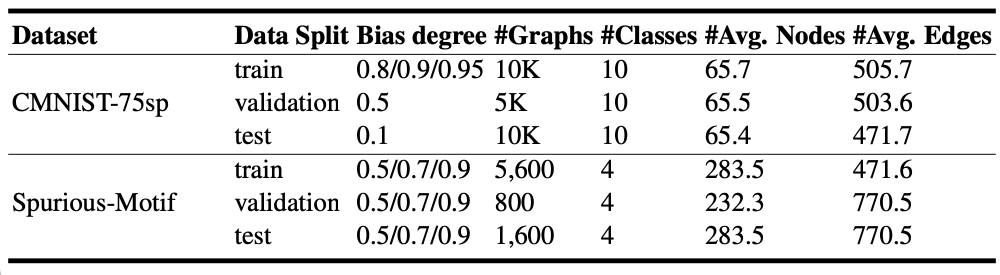

# Uncertainty-aware Causal Graph Learning

## Introduction
GNNs ideally utilize subgraphs to predict labels when the graphs are unbiased, indicating that only causal subgraphs are related to the graph labels. However, graph datasets inevitably contain biases due to uncontrollable data collection methods. Consider Figure 1 where most of the digit backgrounds are the same, such as the red background for “zero”. In this case, GNNs do not need to learn the correct function to achieve high accuracy in predicting the digit labels. Instead, it is much easier for them to learn statistical shortcuts that link the background color with the most frequently occurring digit in each case. Unfortunately, such methods generalize poorly when encountering out-of-distribution (OOD) data, where the background color changes in the testing dataset. Consequently, these non-causal subgraphs, which are only marginally related to the causal part, provide limited exposure to the causal subgraphs for predicting the labels.

<em>Figure 1.</em> CMNIST-75sp Dataset.

## Research Contribution

* We propose the Uncertainty-Aware Causal Graph (UACG), a debiasing mechanism designed for GNN-based graph encoders. UACG aims to disentangle rationale and non- rationale information from the input graph to provide an explanation for a prediction outcome.
* To ensure accurate aggregation at an early stage, we propose a label conformity estimator to identify homogeneous and heterogeneous edges in the graph.
* To facilitate attentive parameter learning, we propose an uncertainty estimator that dif- ferentiates the contributions of sampled graphs. This enables the optimization of graph encoder parameters with varying impacts based on their importance as determined by the uncertainty estimator.
* We define a joint learning objective that incorporates disentangled attention learning, label conformity estimation, and uncertainty estimation for sampled graphs in contributing to the explanation of end-task predictions.
* We conduct quantitative and qualitative studies on four benchmark datasets to address five research questions. UACG outperforms existing methods in terms of end-task performance and rationale quality, providing superior explainability for the prediction outcomes.

## Experiment 
### Research Questions 
* RQ1: How is the quantitative comparison of the effectiveness of generated causal graphs across synthetic benchmark datasets for the end-task of graph classification?
* RQ2: How is the quantitative comparison of the effectiveness of generated causal graphs across real-world benchmark datasets for the end-task of graph classification?
* RQ3: How does the key component contribute to the end-task of graph classification?
* RQ4: How is the quantitative comparison of the quality of generated causal graphs?
* RQ5: How is the qualitative comparison of the quality of generated causal graphs?

### Datasets Information 

<em>Figure 2.</em>  The content of the causal and non-causal subgraphs in the synthetic dataset.

<em>Figure 3.</em>  The detail of synthetic datasets.

<em>Figure 4.</em>  Real-world Dataset.

### Performance On Synthetic Datasets (RQ1)
Analyzing Figure 5 , we observe that the performance gap is not significant for the Spurious-Motif dataset, except for DIR. The dataset’s composition may not be complex, resulting in good performance for most GNN models without debiasing, particularly GIN. Among the debiasing GNN frameworks, CAL performs the best, being unaffected by changes in the bias degree for this variant of the Spurious-Motif dataset. However, the performance of UACG, while not bad, requires further improvement. On the other hand, UACG outperforms other models significantly on the CMINST-75sp dataset, exhibiting a considerable performance gap. Nevertheless, there is a different phenomenon in DIR. Although its accuracy is the worst, its accuracy does not decrease with the increase of bias degree, and it seems most stable. 

<em>Figure 5.</em>  The ACC(%) of graph classification for synthetic datasets. The best results are highlighted in bold.

